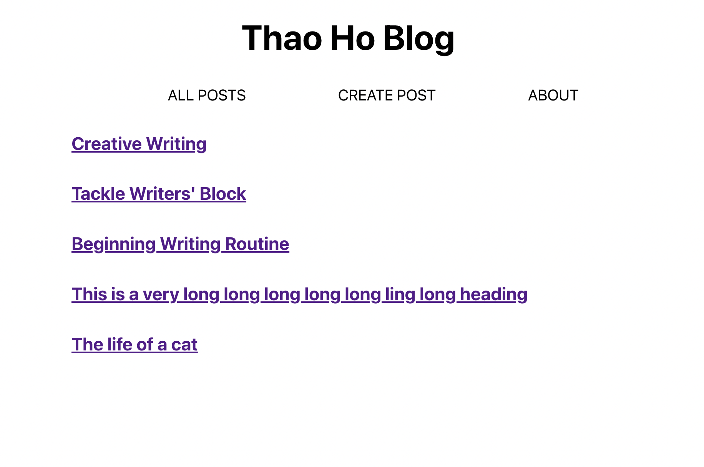
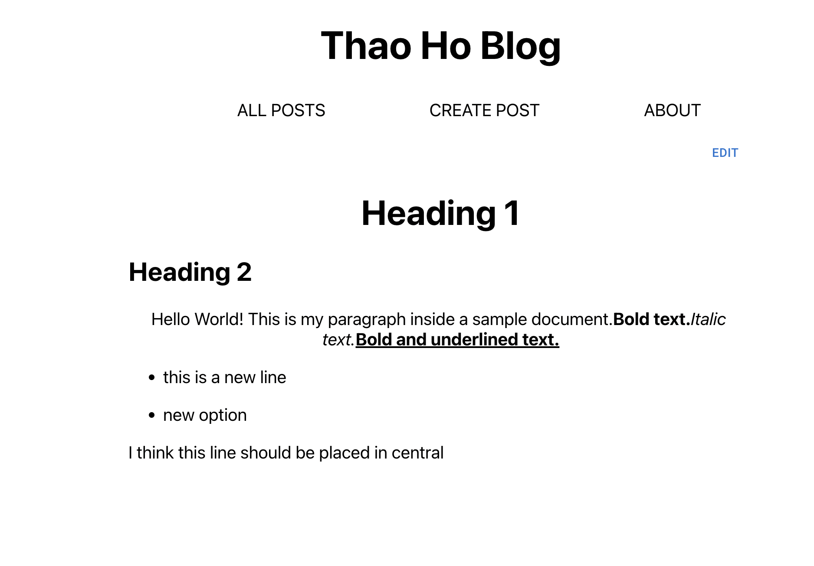

# Description

A personal blog to post articles about any topics

Using React, Express, Mongoose, Slate, Prismjs

# Step to run

- Run api:

  > cd api
  >
  > npm install
  >
  > nodemon server

- Run ui:

  > yarn install
  >
  > yarn start

- Open http://localhost:9000/

# API

- GET http://localhost:5001/posts
- GET http://localhost:5001/users
- POST http://localhost:5001/posts/add
- POST http://localhost:5001/posts/update/626fa2485ff585dcf38de025
- Example body:

```json
{
	"username": "thaoho",
	"title": "Tackle Writers' Blockg",
	"content": [
  {
    "type":"h1",
    "children":[
      {
        "text":"Tackle Writers' Block"
      }
    ]
  },
  {
    "type":"paragraph",
    "children":[
      {
        "text":"A random paragraph can also be an excellent way for a writer to tackle writers' block.
      }
    ]
  }
]
}
```

# UI

Home Page


Edit Post


View Post


About Page

